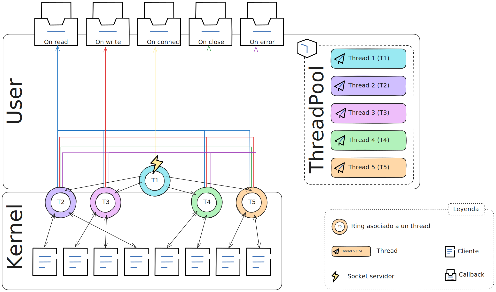
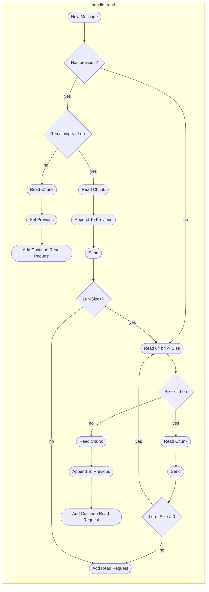

# AsyncSocket



Este diagrama representa el funcionamiento de la función `handle_read`:



Con la siguiente firma:

```c
void handle_read(const struct saurion *const s, const struct request *const req, const size_t len);
```

Donde:

```c
struct saurion {
  struct io_uring *rings;   /**< Array de estructuras io_uring para manejar la cola de eventos. */
  int ss;                   /**< Descriptor de socket del servidor. */
  int *efds;                /**< Descriptores de eventfd para señales internas. */
  struct Node *list;        /**< Lista enlazada para almacenar las solicitudes en curso. */
  pthread_mutex_t status_m; /**< Mutex para proteger el estado de la estructura. */
  pthread_cond_t status_c;  /**< Condición para señalar cambios en el estado. */
  int status;               /**< Estado actual de la estructura. */
  ThreadPool *pool;         /**< Pool de Threads para ejecutar en paralelo las operaciones */
  uint32_t n_threads;       /**< Numero de threads */
  uint32_t next;            /**< Ring al cual añadir evento. */

  struct saurion_callbacks {
    void (*on_connected)(const int fd, void *arg);
    void *on_connected_arg;

    void (*on_readed)(const int fd, const char *const content, const ssize_t len, void *arg);
    void *on_readed_arg;

    void (*on_wrote)(const int fd, void *arg);
    void *on_wrote_arg;

    void (*on_closed)(const int fd, void *arg);
    void *on_closed_arg;

    void (*on_error)(const int fd, const char *const content, const ssize_t len, void *arg);
    void *on_error_arg;
  } __attribute__((aligned(PACKING_SZ))) cb;
} __attribute__((aligned(PACKING_SZ)));
```


```c
struct request {
  void *prev;			/**< Puntero al mensaje anterior incompleto */
  size_t prev_size;  	/**< Tamaño del mensaje anterior */
  size_t prev_offset;  	/**< Bytes leidos hasta este momento del mensaje anterior */
  int next_iov;			/**< Indica que en una lectura han llegado varios mensajes, indicador del iov donde se encuentra el siguiente mensaje */
  size_t next_offset;	/**< desplazamiento dentro del iov indicado por next_iov donde comienza el siguiente mensaje */
  int event_type;
  int iovec_count;
  int client_socket;
  struct iovec iov[];
};
```

La nueva función `handle_read` lee un nuevo mensaje contenido en el array `iov[]` de `req`. En el caso de que no haya un mensaje previo, es decir, `req->prev == NULL` los primeros 64bits del mensaje son el tamaño del mensaje, si ese tamaño coincide con `len` entonces el mensaje está completo, si es menor se ha de esperar al siguiente mensaje.

La función para `Add Read Request` es:

```c
void add_read(struct saurion *const s, const int client_socket);
```

La función para `Add Continue Read Request` es:

```c
void add_read_continue(struct saurion *const s, const struct request *const oreq, const int sel, const size_t size);
```


Optimizar esta función:

```c
struct request {
  void *prev;			/**< Puntero al mensaje anterior incompleto */
  size_t prev_size;  	/**< Tamaño del mensaje anterior */
  size_t prev_offset;  	/**< Bytes leidos hasta este momento del mensaje anterior */
  int next_iov;			/**< Indica que en una lectura han llegado varios mensajes, indicador del iov donde se encuentra el siguiente mensaje */
  size_t next_offset;	/**< desplazamiento dentro del iov indicado por next_iov donde comienza el siguiente mensaje */
  int event_type;
  int iovec_count;
  int client_socket;
  struct iovec iov[];
};

void read_chunk(void **dest, struct request *const req, size_t size) {
  size_t msg_size = 0;
  size_t o_s = 0;
  size_t o_iov = req->next_offset;
  size_t i = 0;
  size_t curr_len = 0;
  if (!req->prev && req->iovec_count > 0) {
    msg_size = *((size_t *)(req->iov[req->next_iov].iov_base + o_iov));
    o_iov += 8;
    o_s = 0;
    free(*dest);
    *dest = malloc(msg_size + 1);
    memset((*dest + msg_size), 0, 1);
    for (i = req->next_iov; i < req->iovec_count && (msg_size - o_s); ++i) {
      curr_len = ((msg_size - o_s) > (req->iov[i].iov_len - o_iov)
                      ? req->iov[i].iov_len - o_iov
                      : msg_size - o_s);
      memcpy(*dest + o_s, req->iov[i].iov_base + o_iov, curr_len);
      o_s += curr_len;
      curr_len += o_iov;
      if (!i) {
        o_iov = 0;
      }
    }
  } else if (req->iovec_count > 0) {
    msg_size = req->prev_size;
    o_s = req->prev_offset;
    *dest = req->prev;
    for (i = 0; i < req->iovec_count && (msg_size - o_s); ++i) {
      curr_len = ((msg_size - o_s) > (req->iov[i].iov_len) ? req->iov[i].iov_len
                                                           : (msg_size - o_s));
      memcpy(*dest + o_s, req->iov[i].iov_base, curr_len);
      o_s += curr_len;
    }
  }
  if (msg_size - o_s) {
    req->prev = *dest;
    req->prev_size = msg_size;
    req->prev_offset = o_s;
  } else {
    req->prev = NULL;
    req->prev_size = 0;
    req->prev_offset = 0;
    --i;
    if (i < req->iovec_count || curr_len < (req->iov[i].iov_len)) {
      req->next_iov = i;
      req->next_offset = o_iov + curr_len + 1;
    }
  }
}
```

